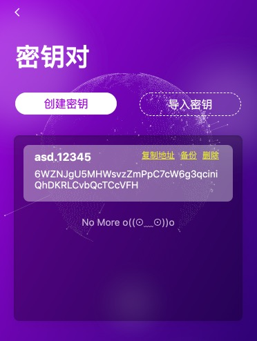
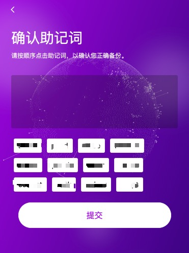
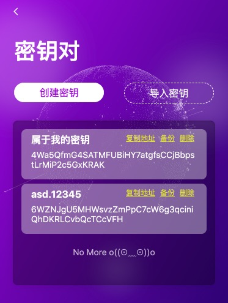

# Keypair

## 创建密钥

*如果你已经拥有了Keypair，请直接查看 [Keypair的备份与导入](backup-import.md)



点击图中所示的 ```创建密钥``` 按钮创建属于你的Keypair


这里我们输入 ```属于我的密钥```

你也可以输入任意一个你喜欢的Keypair的别名，来创建属于你自己的Keypair。

## 备份助记词

首先，你要备份你的助记词，助记词与你的 keypair 是一对一的关系，请仔细抄写助记词并妥善保管。

请勿使用截图，因为他人获取到你的助记词的同时他也将直接获取你的资产。

如果你不进行助记词的备份，那么你将无法创建这个Keypair。


按照顺序排列你所记录的助记词，用来确保你所记录的助记词为正确的。



## 创建完成

创建完成后，在Keypair管理中，你就可以看到刚刚创建的 ```属于我的密钥```
并可以看到与该Keypair相对应的地址 你可以点击 ```复制地址``` 复制你的 keypair 地址。

其他人可以通过该地址使用 AELF钱包 向你当前的账户进行Token转账。




