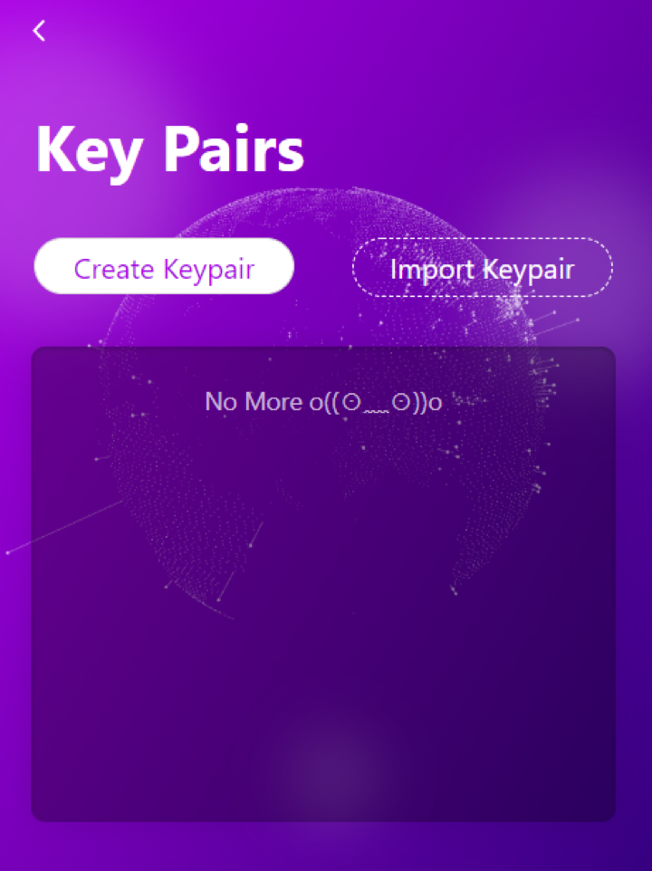
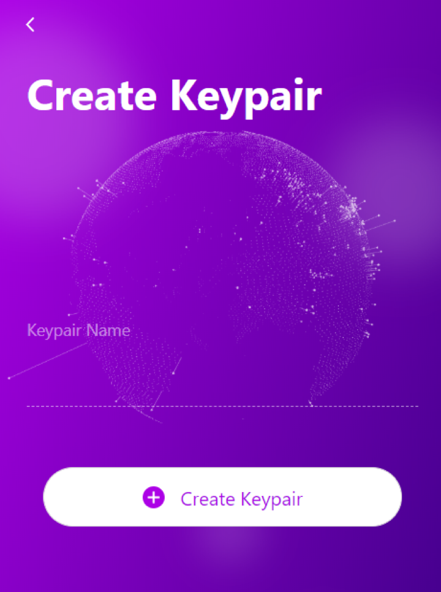
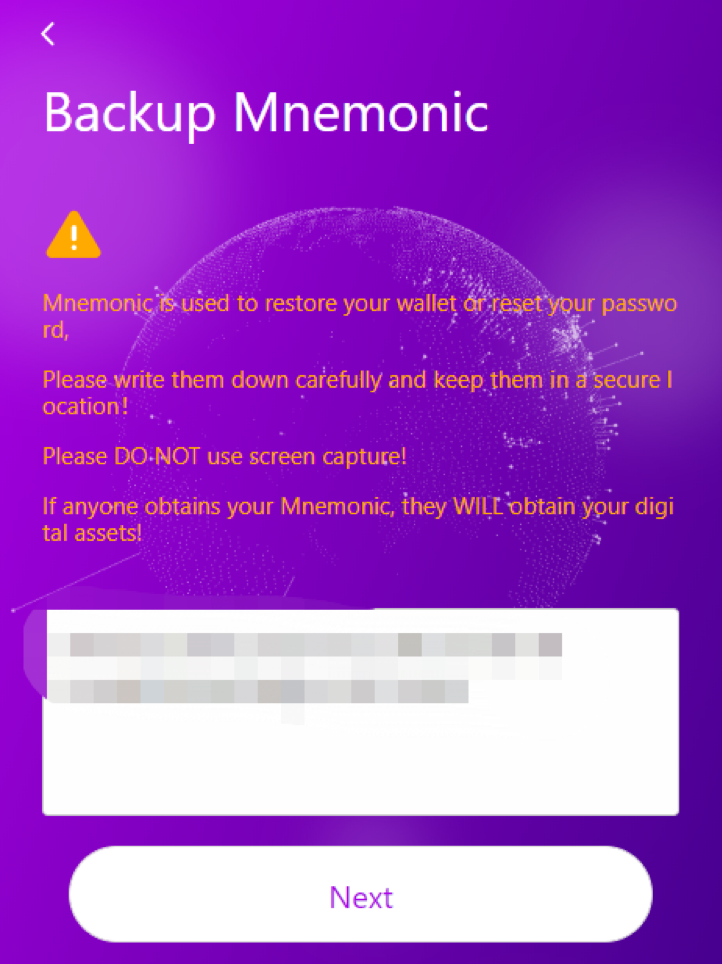
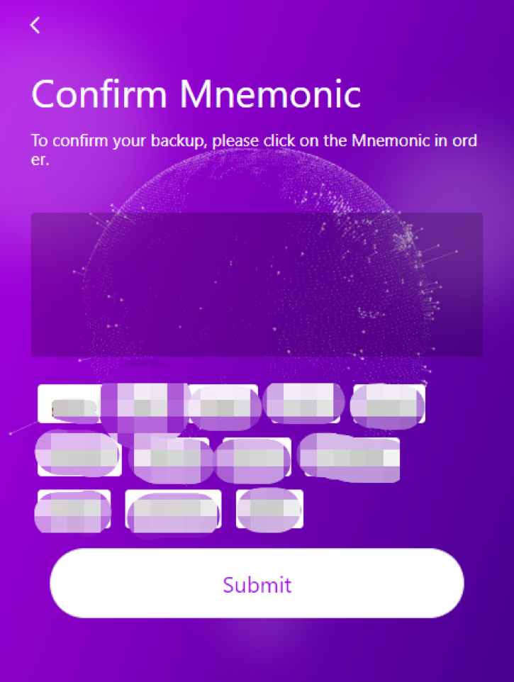

# Keypair

## Create Your Key

If you already have a Keypair, please check the [Backup Keypair / Import Keypair](backup-import.md) directly.



Click the ```Create Keypair``` button shown in the picture to create your Keypair



You can also enter any name for your Keypair alias.

## Mnemonic

First of all, you have to back up your mnemonic words. The mnemonic words and your keypair have a one-to-one relationship. Please copy the mnemonic words carefully and keep them in a safe place.

Please do not screenshots it, because if other people have the screenshots, they can get your assets directly with your mnemonic.

If you do not back up your mnemonic, then you will not be able to create the Keypair.



Arrange the mnemonics you have recorded to ensure that the mnemonics you have recorded are correct.



## Finish Creation

After the creation is complete, when you go to Key Pairs page, you can find the priviate key you just created and you can see the address corresponding to the Keypair. You can click ```Copy Address``` to copy your keypair address.

Then, others can use their AELF wallets to transfer tokens to your current address.
