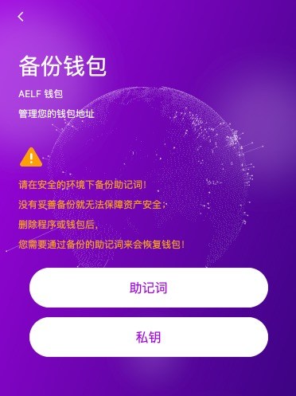
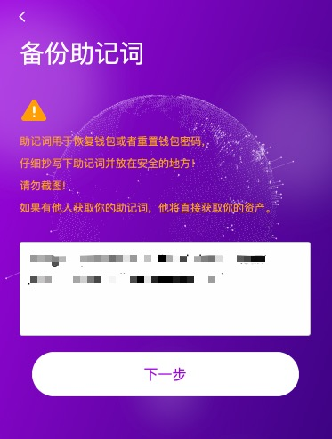
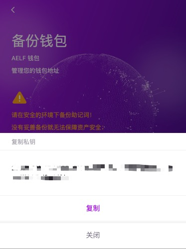
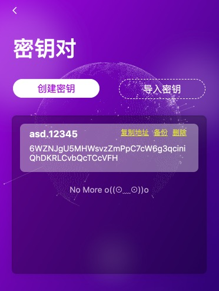
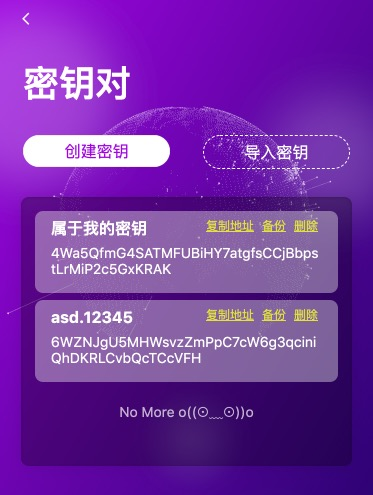

# Backup & Import

## 备份 Keypair

如果你不慎遗失了你所记录的助记词怎么办？

这时候不要紧张，你只需要在 Keypair管理下找到 ```备份``` 



这时你可以看到，你可以进行 ```助记词``` 的备份与 ```私钥``` 的备份。
无论是助记词还是私钥都可以帮助你导入你的Keypair。

点击你想要备份的类型，会弹出密码输入弹出昂，这里需要你输入你所设置的NightELF 密码。

1. 如果你选择了备份助记词，那么你的助记词会显示在当前界面中。

    

    你可以重新抄写你的助记词，并妥善保管。

2. 如果你选择了备份私钥，那么你将会看到私钥，并记录它。

    同样你的私钥也不能透露给其他人，如果他人得到了你的私钥他一样可以得到你的资产。

    


## 导入 Keypair

如果你不慎卸载了 Chrome 浏览器，或者你的设备发生了损坏，不得已需要在其他设备上使用NightELF

你可以通过 导入Keypair 的方式导入你的Keypair。



点击 ```导入密钥``` 按钮


我们提供了```助记词``` 与 ```私钥``` 两种导入方式。无论你是用```助记词```还是用```私钥```都可以导入你的 Keypair，你可以通过点击助记词或者点击私钥来进行切换。（请勿将私钥填入助记词、或助记词填入私钥，这样做无法帮你找回keypair）


输入```助记词```或者```私钥```后，输入Keypair别名，这里Keypair别名无需与之前相同，我们会帮你重新命名。

点击 ```提交``` 按钮后，你就可以看到已经导入的Keypair了。




