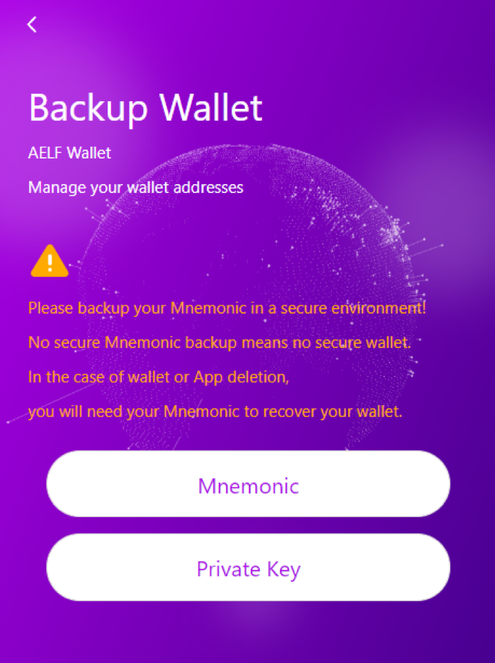
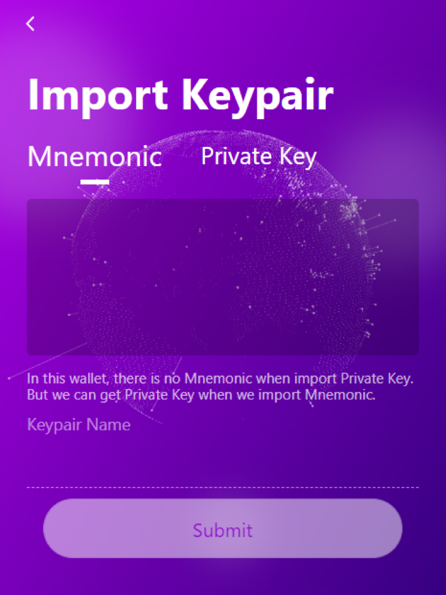

# Backup Keypair / Import Keypair

## Backup keypair

What if you accidentally lose your mnemonic?

Don't worry, you just need to click ```backup``` in Key Pairs page.



Then, you can use ```Mnemonic``` and ```Private key``` to back up. Both mnemonics and private key can help you to import your Keypair.

Click on the type you want to back up. A password input will pop up. Here you need to enter your NightELF password before backup.

## Import Keypair

If you accidentally uninstalled Chrome or your device was damaged and you will have to use NightELF on other devices.

We provide two methods: ```Mnemonic``` and ```Private Key```. Whether you use a mnemonic or a private key can import your Keypair, you can switch by clicking the mnemonic or clicking the private key. (Do not enter the private key into the mnemonic or the mnemonic into the private key, this will not help you to retrieve the keypair).


Click the ```Import Keypair``` button


