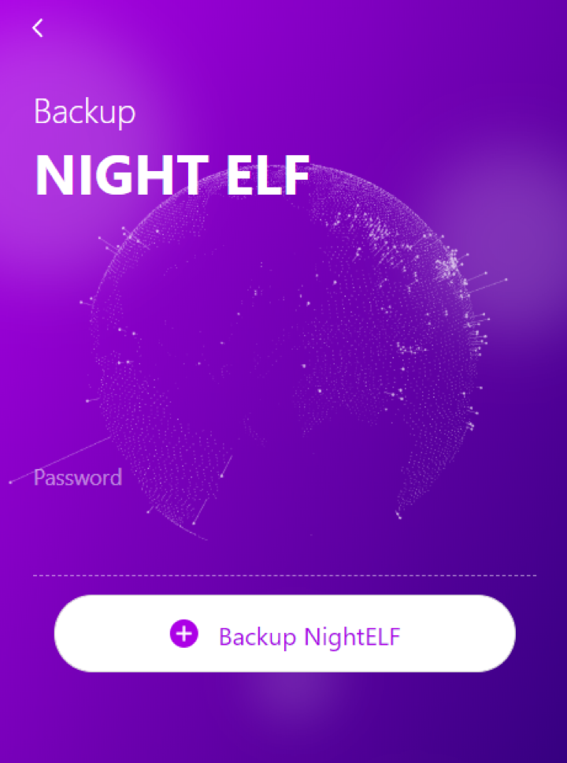

# Backup NightELF

You can back up your NightELF data to prevent your device from being damaged or lost.

You can go to homepage first, then click Extension ```Management``` > ```Backup NightELF```, enter your password and click Backup NightELF.



Click ```Backup NightELF```

The browser will download the file named ```NightELF_backup_file_xxxxxx.txt```.

Do not modify the file to prevent the data cannot be recovered. Please properly store the file. It is also recommended that you backup your NightELF once in a while.

The file is encrypted. You cannot directly get your keypair information when you open the file, but you still need to keep it properly.
