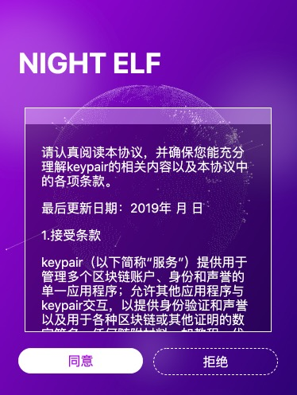
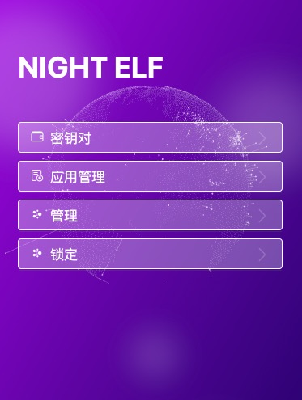

# 创建 NightELF

## 创建

你可以把 NightELF 看做一个 keypair 与 授权的管理工具，你的所有 Keypair 与相应的授权情况都会在 NightELF 中显示，并且你可以通过。在初次使用 NightELF 的时候, 你需要做如下操作。


首选你需要输入一个长度至少达到9位的密码，需要有一定的复杂程度, 可以包含大写字母、小写字母、符号、数字。
然后点击 ```创建钱包``` 按钮

## 协议

通过上一步，你可以看见NightELF的使用协议，请详细阅读我们的使用协议并决定您是否要使用NightELF，然后点击同意或者取消



## 使用界面

如果您看到了以下界面，证明你已经创建成功了。




