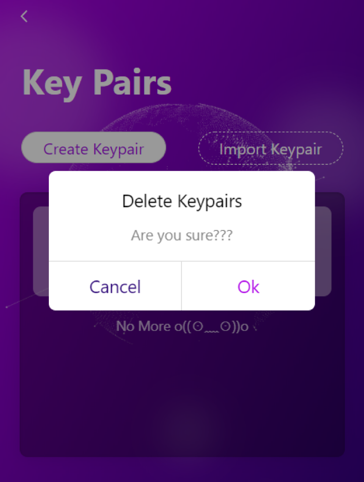

# Delete Keypair / Delete NightELF

## Delete Keypair

If you want to remove the Keypair in your NightELF, click the corresponding delete button on the Keypair management page. This operation does not require you to provide the NightELF password.



Click the ```OK``` button to delete the keypair you want to delete, but this operation will not delete the Dapp authorization you made to the keypair.

## Delete NightELF

If you want to remove NightELF and clear the data, you can delete it by deleting NightELF on the Application Management page. This operation requires you to enter your NightELF password. You can also delete NightELF directly in Chrome.
