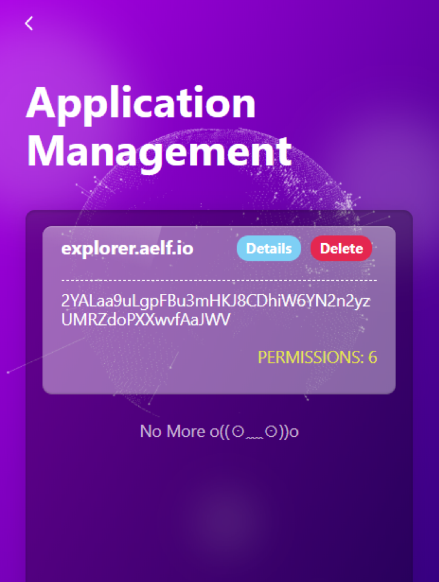

# Permission Manager

When you authorize a Dapp permission, you can view your authorized information in NightELF.

You can view all your authorization information through the ```Application Management``` page.



You can go to the ```Details page``` to check authorized detailed contract information such as contract addresses, contract names, contract details, etc.

You can choose to authorize permissions of a contract or you can choose to remove all permissions. This step does not require you to provide your NightELF password, but you need to be aware that deleting a contract may prevent you from continuing to use the contract method of the contract.

If you delete the MultiToken contract, then you will not be able to perform transfers and asset queries.
