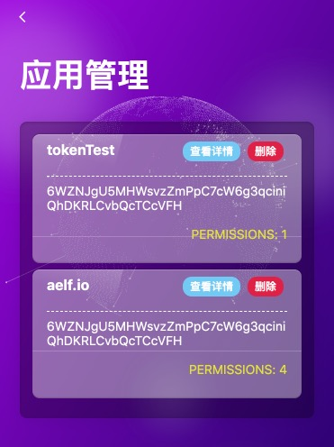
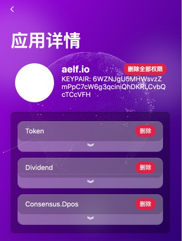

# Permission Manager

当你授权某一Dapp权限时，你可以在NightELF中查看你授权的信息。

你可以通过 Home 中的 ```应用管理``` 查看你的所有授权信息。



你可以通过 ```查看详情``` 查看授权的详细合约信息，包含合约地址、合约名称、合约详细信息等....



你可以选择删除某一个合约的权限，也可以选择删除全部权限。这一步不需要你提供 NightELF 密码，但是需要注意，删除某一合约可能导致您无法继续使用该合约的合约方法。

如果你删除MultiToken合约，那么你将无法进行转账与资产查询。

