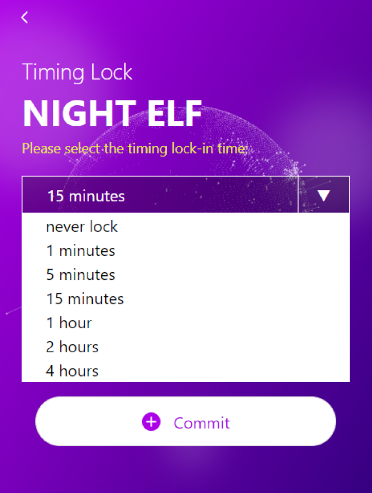

# Timing Lock

## Why do we need to set Timing Lock

If you have finished authorization, left your personal device for a long period of time, and forget to lock it, it is very unsafe for your assets. Anyone can operate through NightELF. NightELF will set a lock time of 15 minutes by default. If you do not perform any operation within 15 minutes, NightELF will automatically lock to protect your assets.

## How to set the Timing Lock

If you think the default time is too long or too short, you can set different lock time. We provide some different time intervals for you to choose, you can also choose not to use the Timing Lock.

