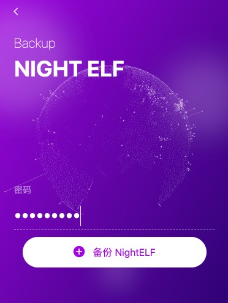

# 备份插件

## 备份 NightELF

你可以备份你的NightELF数据，防止你的设备损坏或丢失。

你可以在NightELF主页点击 `管理` -&gt; `备份NightELF` 然后输入你的 NightELF 密码。

点击 `备份NightELF`

浏览器会下载名为 `NightELF_backup_file_xxxxxx.txt` 文件， 请勿修改文件内的内容以防出现无法恢复数据的情况，并妥善存储该文件，同样建议你每隔一段时间就对 NightELF 进行一次备份。

文件经过加密处理，打开文件无法直接获取你的keypair信息，但是你依然要妥善保存。

