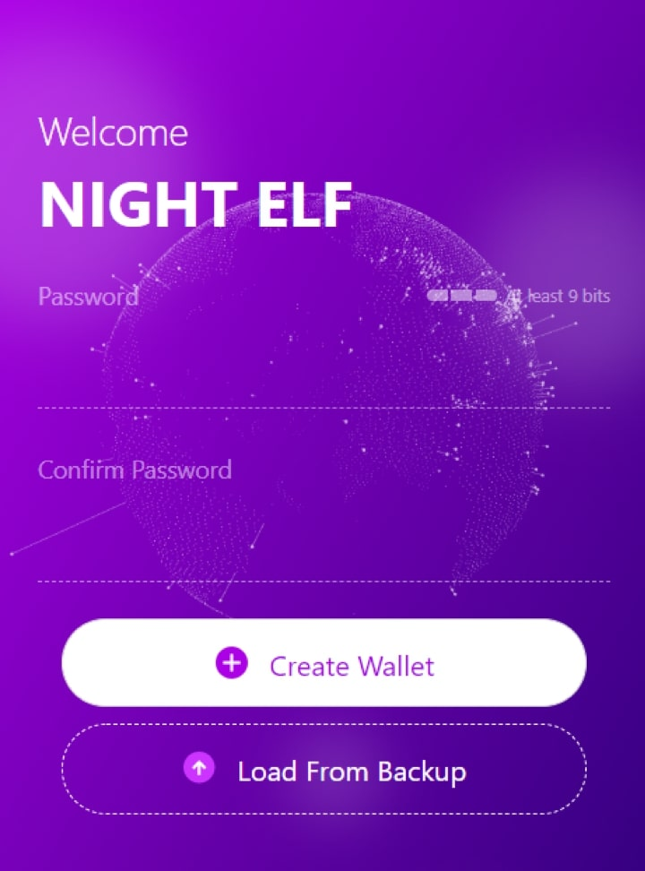
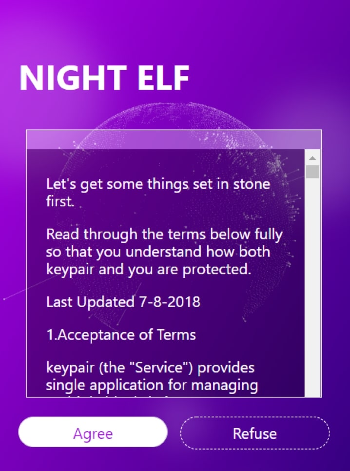
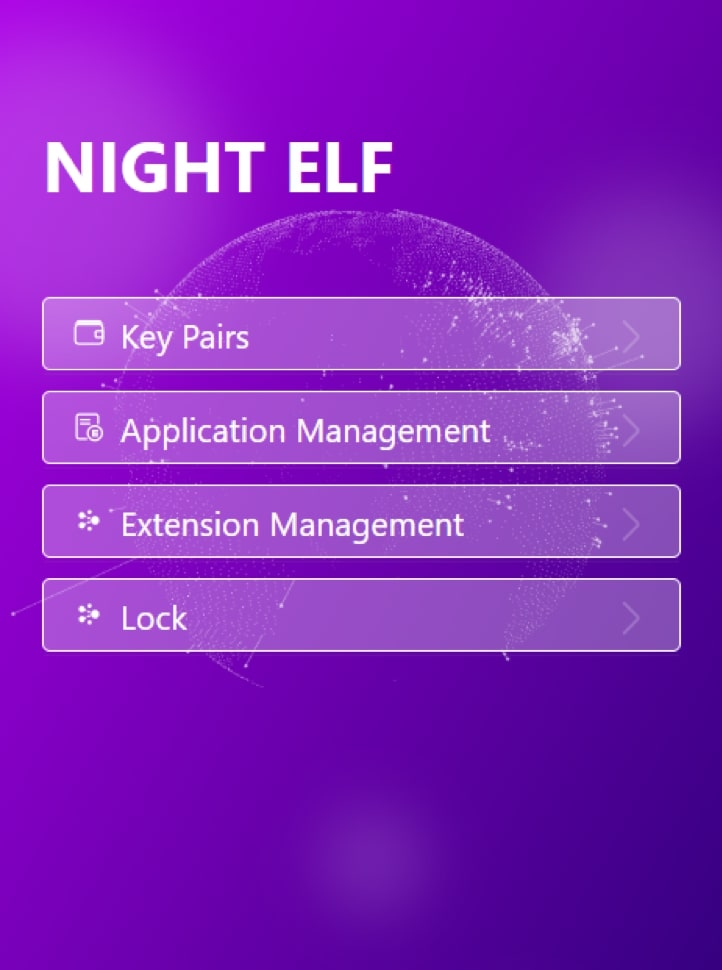

# Create

## Create NightELF Account

You can think of NightELF as a keypair and authorization management tool. All your keypairs and corresponding authorizations will be displayed in NightELF and you can manage them. When you are using NightELF for the first time, you need to do the following.

First, you need to enter a password with a length of at least 9 digits, which must have a certain degree of complexity. It can contain uppercase letters, lowercase letters, symbols, numbers. Then click the `Create Wallet` button

## Protocol

Through the previous step, you can see the NightELF User Agreement, please read it carefully and decide whether you want to use NightELF, then click Agree or Refuse

## Homepage

If you see the following page, which means you have successfully created your NightELF account.

