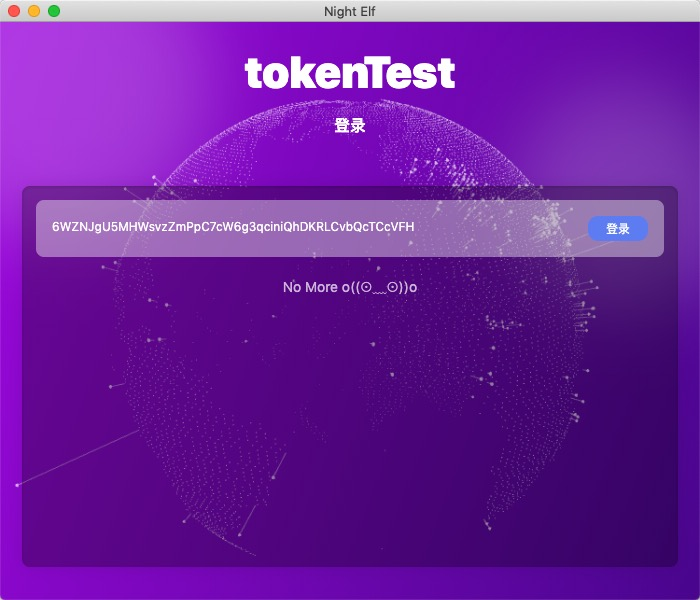
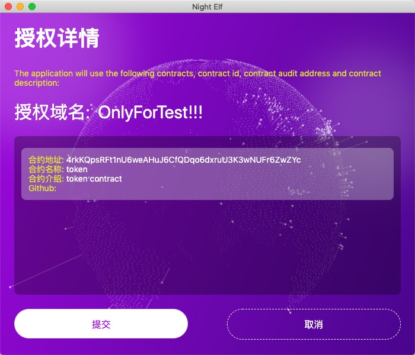

# 如何在DApp中使用

## 如何在Dapp中使用NightELF

当你进入一个符合AELF生态的 Dapp时，通常第一步会弹出提示框让你进行授权，你可以选择你任意的Keypair进行授权。

点击 `登录` 你可以看到看到当前 Dapp 所需要授权的详细信息。这可能包含 域名、合约地址、合约名称、合约介绍、Github地址等。

如果你关掉这个窗口或者点击`取消` 则认为你不允许这次应用授权，那么你可能将无法使用该Dapp或者无法使用Dapp的大部分功能。

看到成功的提示后，你可以到NightELF的`应用管理`查找你授权的信息，如果你不知道如何找到授权信息可以查看[Permission Manager](permission.md)

