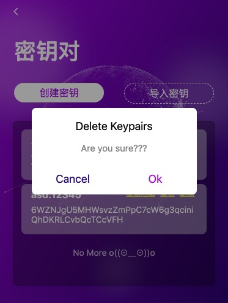

# 删除密钥对/插件

## 删除 Keypair

如果你想在 NightELF 中移除某个 Keypair 你只需在 Keypair 管理页面点击相应的删除即可，这一操作无需你提供 NightELf 密码。

点击`确认` 按钮即可删除你想要删除的Keypair，但是这一操作并不会删除你对该 Keypair 做的Dapp授权。

## 删除 NightELF

如果你想移除NightELF并清空数据，你可以通过 `管理` 中的 `删除NightELF` 进行删除，这一操作需要你输入你的NightELF密码，你也可以直接在Chrome中删除 NightELF 同样可以清空数据。

