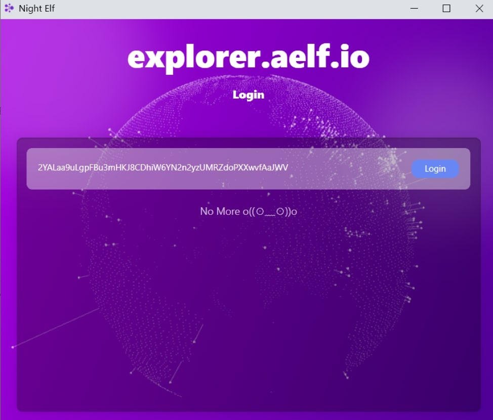
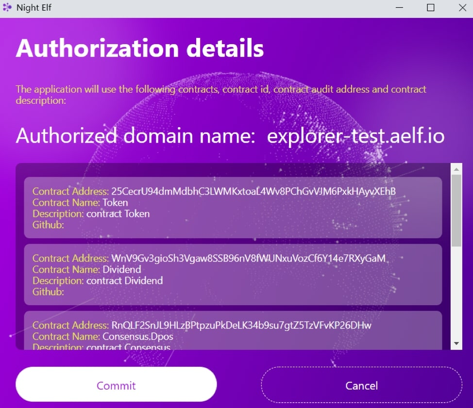

# How to use in Dapp

## How to use NightELF in DAPP

When you enter a Dapp that complies with the AELF ecosystem, usually the first step will be a pop up a prompt box for you to authorize, you can choose any Keypair to authorize.

Click the `Login` button, then, you can see the details of authorizations required by the current Dapp. This may include the domain name, contract address, contract name, contract description, Github address, etc.

If you close this window or click `Cancel`, this action means you do not allow this application’s authorizations, then you may not be able to use the Dapp or most of the functions of the Dapp.

After you submit and authorize the application, you can go to NightELF's `Application Management page` to find your authorization information. If you don't know how to find the authorization information, you can check [Permission Manager](permission.md).

