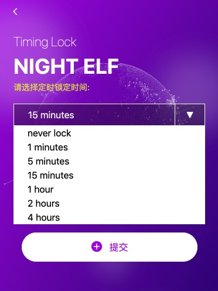

# 自动锁定

## 为什么要设置定时锁定

如果你已经做过授权，并且长时间离开你的个人设备并忘记锁定，那么对于你的资产是极其不安全的。任何人都可以通过NightELF进行操作。 NightELF 默认会设置15分钟的锁定时间，十五分钟之内你如果未做任何操作，NightELF会自动锁定，以此来保护你的资产安全。

## 如何设置定时锁定

如果你认为默认时间太长或者太短，你可以对定时锁定时间进行设置。我们提供了部分时间区间供选择，你也可以选择不需要自动锁定。

